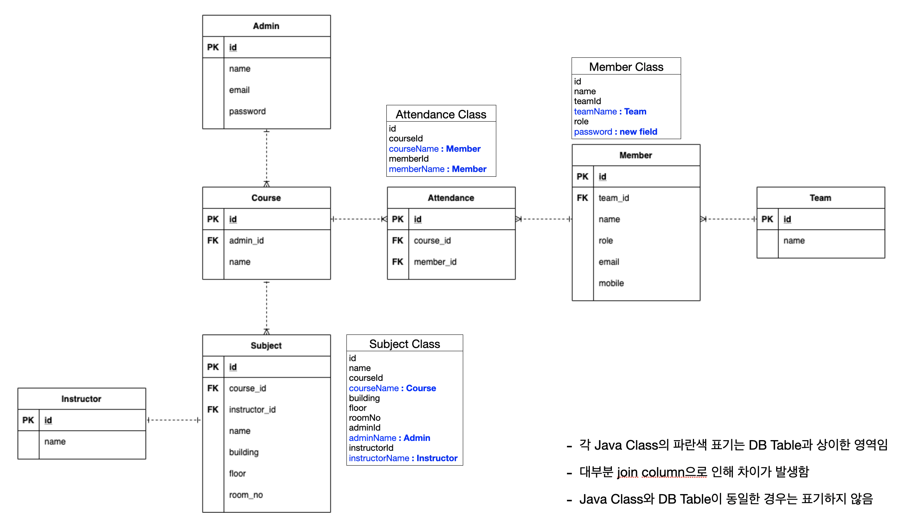

# amf-edu-monolithic
https://github.com/AMF-skcc/amf-edu-monolithic

## 요약
가상의 수강신청 시스템

## model

### 테이블 설명
#### Admin
- Course를 관리하는 Admin
- 시스템 Admin과 다른 개념

#### Course
- 여러개의 Subject를 묶어서 만든 교육 과정

#### Subject
- 단일 과목

#### Instructor
- Subject을 가르키는 강사 정보

#### Attendance
- Course에 대한 출석부
- Course와 Member의 매핑 테이블

#### Member
- 교육 수강생

#### Team
- Member가 속한 팀
